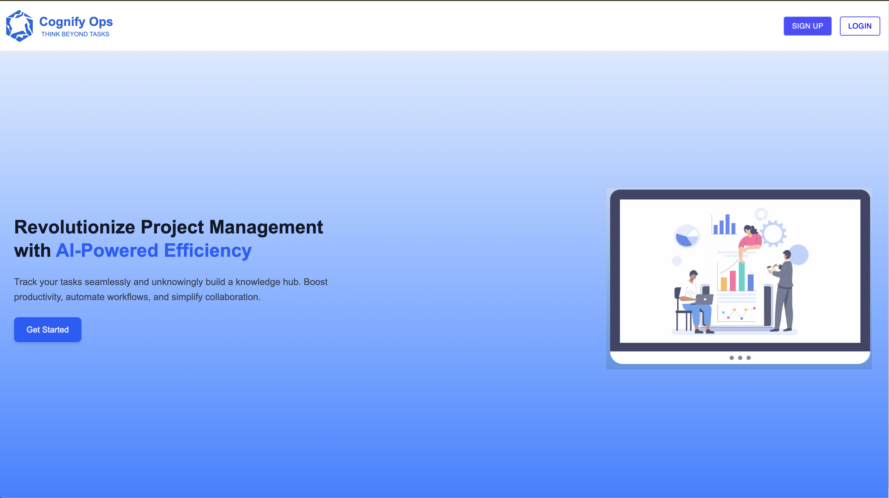
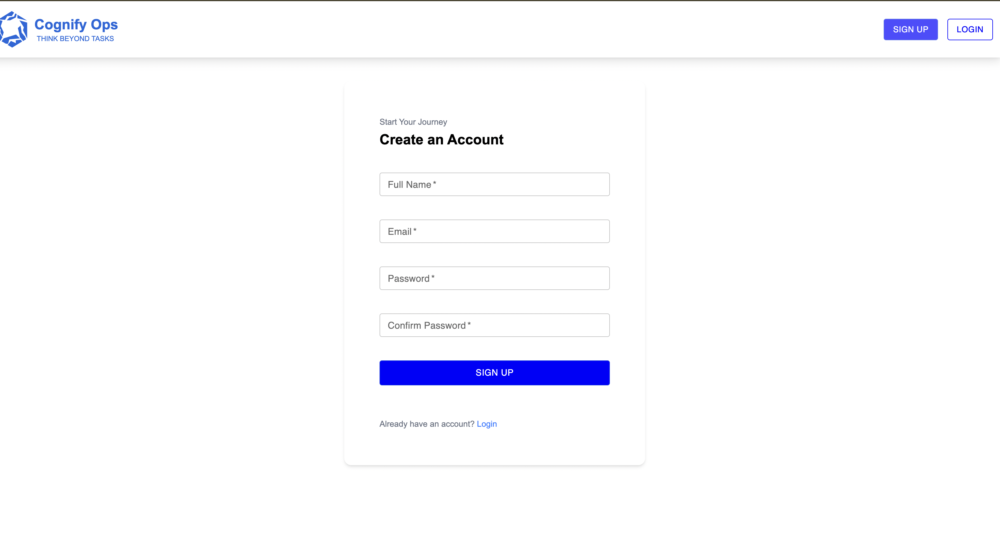
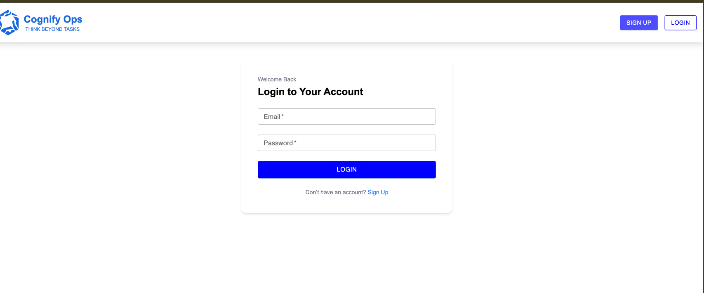
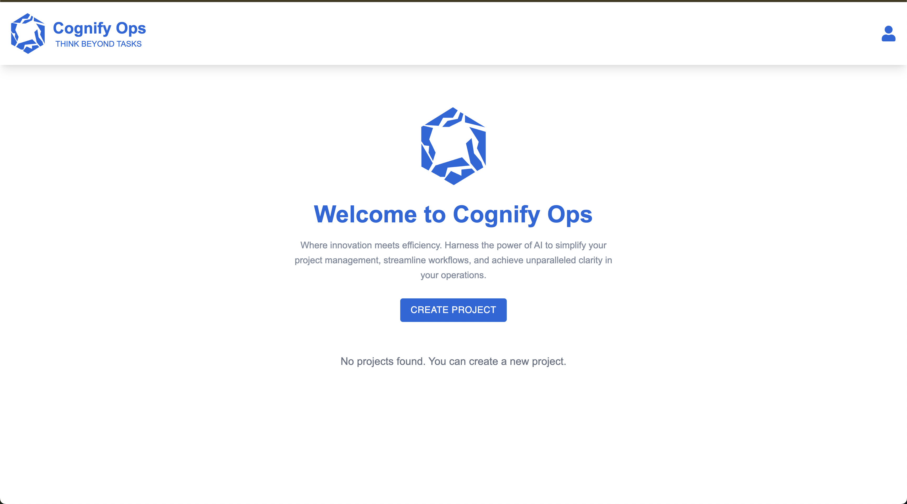
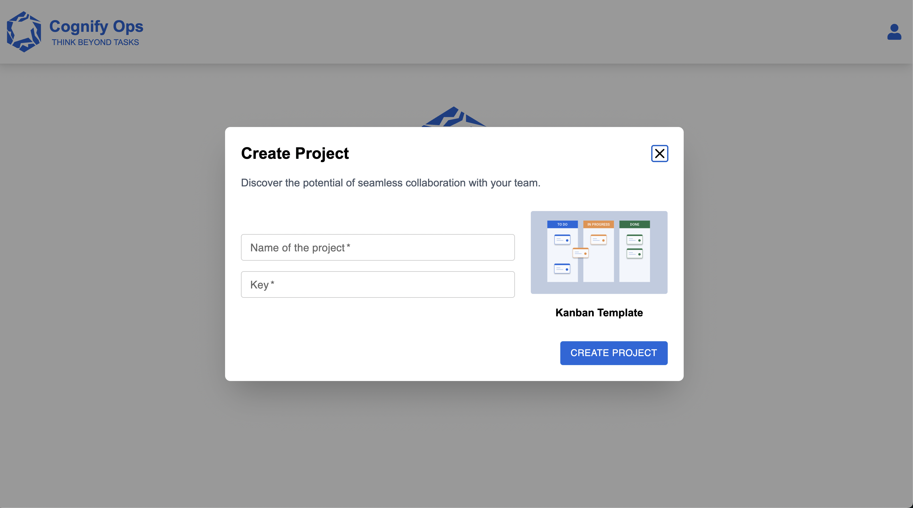
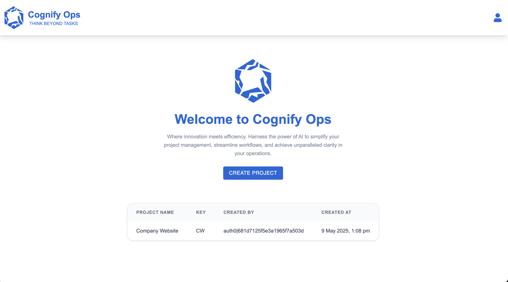
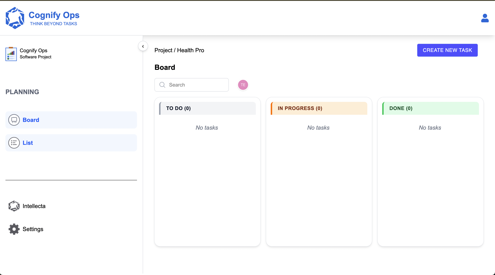
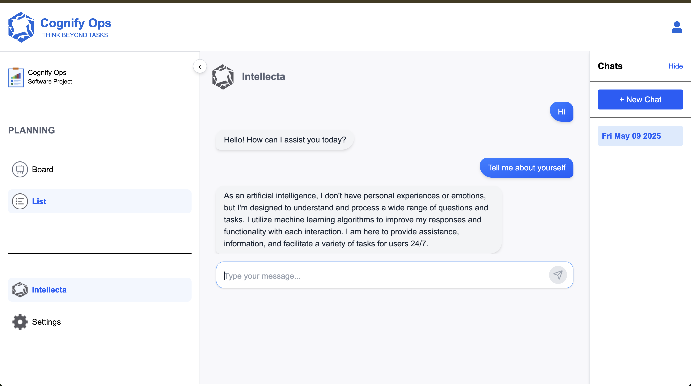

# Project Name: **Project Management App** --> Cognify Ops

## Web App URL:
You can access the web app at: [Project Management App](https://dzzb1r47lczqe.cloudfront.net/)

## Overview
This is a project management web application that allows users to create and manage projects, track tasks using a Kanban board, and interact with AI to ask project-related questions. It provides authentication via sign-in and sign-up pages, a project list, project creation dialog, and a Kanban board for task management.

## Features
- **Landing Page**: A welcome page with options to sign in or sign up.
- **Sign In Page**: Users can log in with their credentials.
- **Sign Up Page**: New users can sign up to create an account.
- **Project List Page**: View a list of all your projects.
- **Project Creation**: Create new projects using the project creation dialog.
- **Kanban Board**: Manage your project tasks using a Kanban board.
- **AI Portal**: Ask AI questions related to your project.

### **Login Credentials for Testing** (No need to sign up):
- **Email**: `testuser@gmail.com`
- **Password**: `ComplexPassword@123`

## Screenshots
- **Landing Page**:
  
  
- **Sign In Page**:
  
  
- **Sign Up Page**:
  
  
- **Project List Page**:
  
  
- **Project Creation Dialog**:
  
  
- **Project Listed After Creation**:
  
  
- **Kanban Board**:
  
  
- **AI Portal**:
  
